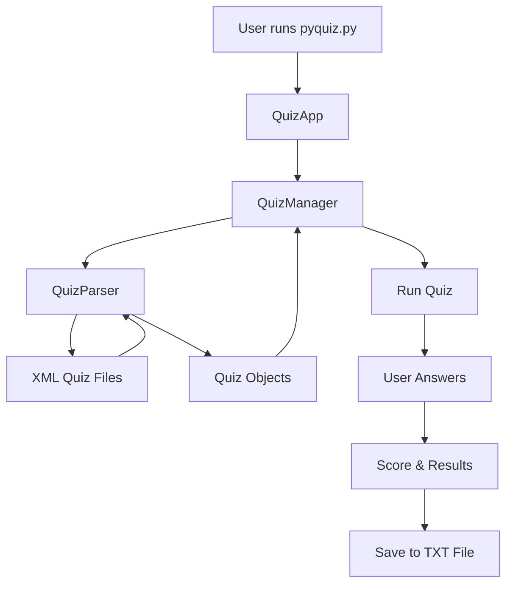
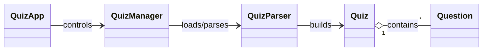

# 🧠 Interactive Quiz  
**Python • Object-Oriented Design • XML Data Storage**

An interactive **terminal-based quiz application** built with Python using **Object-Oriented Programming (OOP)** and **XML-driven data**.  
The system allows users to take quizzes, track their results, and save outcomes in .txt format — while allowing new quizzes to be added **without changing the code**.

This project is based on the Joe Marini LinkedIn Learning course and extended as an educational OOP + data-driven architecture example.

---

# 🚀 Key Features

- 📚 List all available quizzes  
- 📝 Take quizzes with **Multiple-Choice** and **True/False** questions  
- 📊 Automatically calculate score and statistics  
- 💾 Save quiz results to a `.txt` file  
- 📦 Add new quizzes simply by editing XML files  
- 🧩 Fully object-oriented architecture  

---

# 🧠 Project Advantages

This project demonstrates **real-world backend architecture** principles:

| Concept | How It Is Used |
|--------|----------------|
| **OOP (Object-Oriented Programming)** | Quiz logic, parsing, and UI control are encapsulated in classes |
| **XML as Data Layer** | Questions are stored externally and parsed at runtime |
| **Separation of Concerns** | UI, quiz logic, and data parsing are fully separated |
| **Extensibility** | New quizzes can be added without touching Python code |
| **Testable Architecture** | Classes are isolated and reusable |

This is exactly how professional applications separate **data**, **logic**, and **presentation**.

---

# 🧩 Application Architecture


---

# 🧱 Class Responsibilities


    
---


# 📁 File & Class Responsibilities
```
| File / Class | Role |
|---|---|
| `pyquiz.py` | Application entry point. Starts the program and displays the menu |
| `QuizApp` | Controls the user experience (menu, navigation, exit) |
| `QuizManager` | Manages available quizzes and user actions |
| `QuizParser` | Reads XML files and builds `Quiz` objects |
| `Quiz` | Presents questions, checks answers, calculates score |
| `*.xml` | Stores quiz data (questions, choices, correct answers) |
| `results_*.txt` | Saved quiz results generated after finishing a quiz |
```
---

# 🧠 How XML Powers the App

Instead of hard-coding questions, quizzes are stored externally in XML, so you can add/edit quizzes **without changing Python code**.

```
<quiz>
  <question>
    <type>multiple</type>
    <text>What does OOP stand for?</text>
    <choice>A) Only One Program</choice>
    <choice>B) Object Oriented Programming</choice>
    <choice>C) Open Office Protocol</choice>
    <answer>B</answer>
  </question>
</quiz>

```
---

# 🖥️ Running the App

Right-click pyquiz.py

Run in terminal

Enter your name

Use the menu:

(M) Repeat menu
(L) List quizzes
(T) Take a quiz
(E) Exit


After finishing a quiz, you will see:

Date & time
Number of questions
Correct answers
Total score
You can then save it as a .txt file.

---

# 📈 Future Upgrades

- Web or GUI interface (FastAPI / Tkinter)
- Question categories
- User profiles
- Leaderboards
- JSON support
